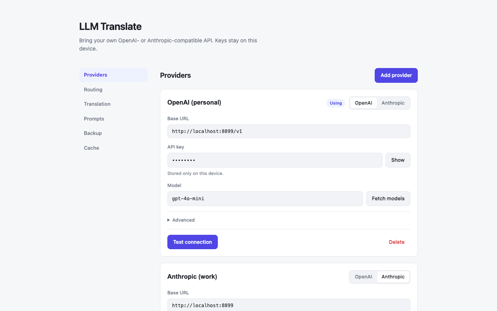
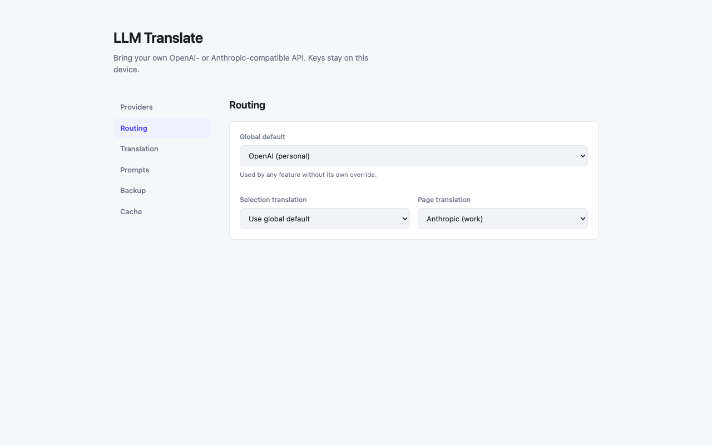
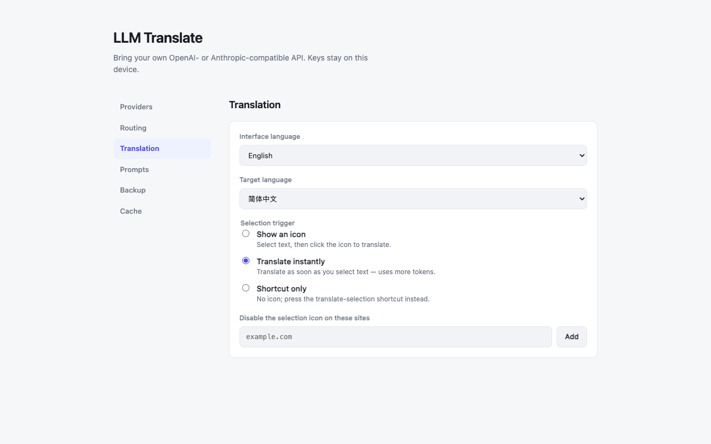
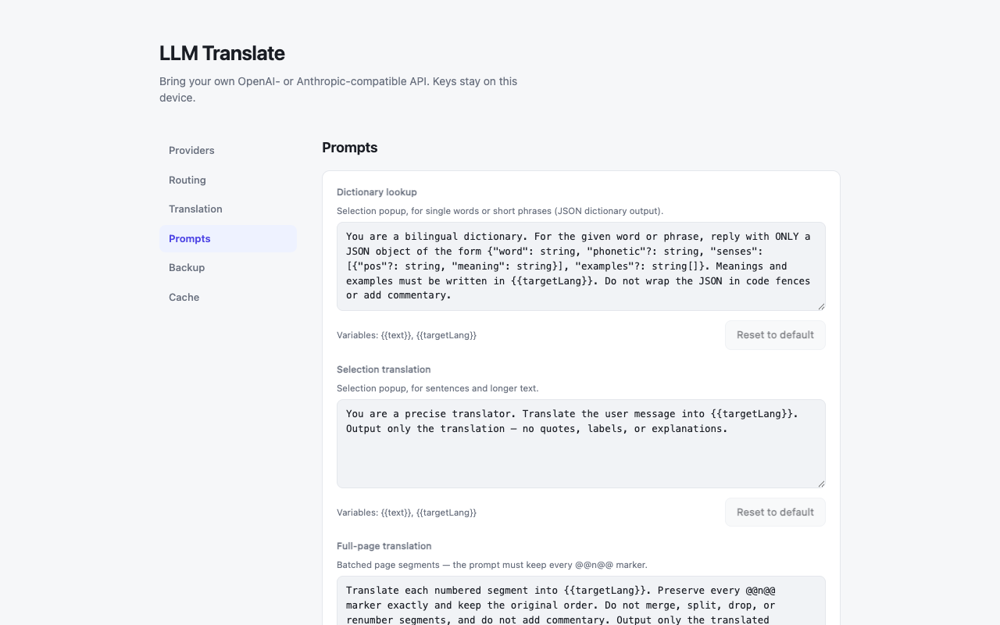
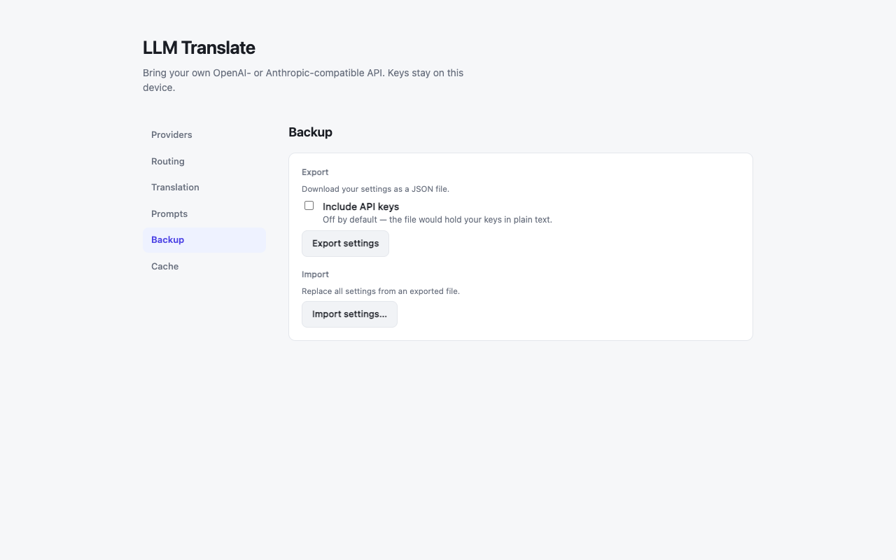
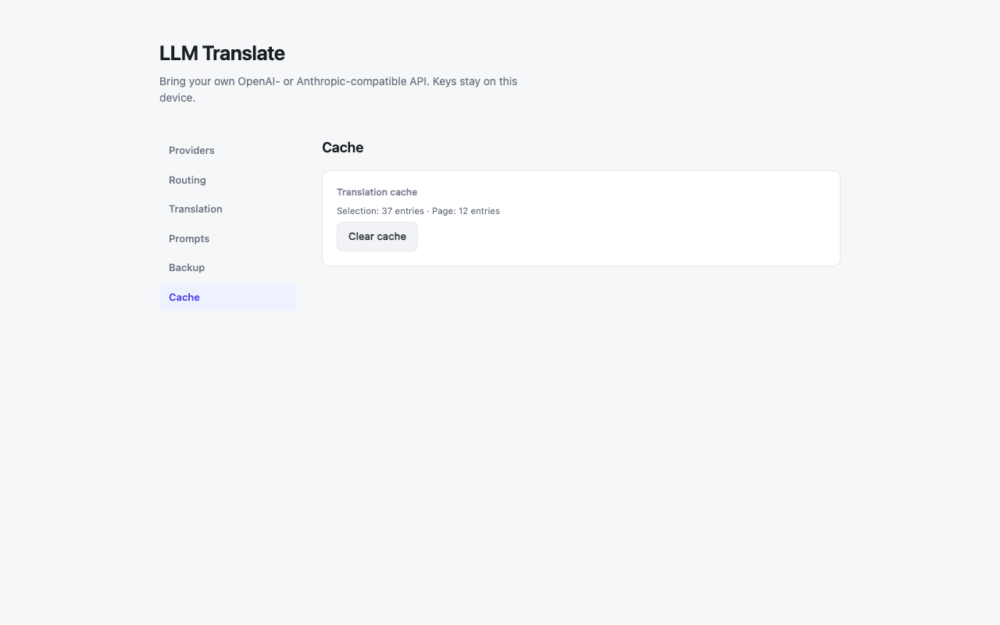

# LLM Translate

[English](./README.md) · **简体中文**

> 浏览器划词翻译 + 全文翻译扩展,翻译能力完全由**你自己的** OpenAI 兼容或 Anthropic
> 兼容 API Key 驱动(BYOK)。无账号、无自建后端、无遥测——所有配置只存在你本机。

**当前状态:** 划词翻译与全文翻译已完整可用,端到端测试、图标素材、隐私政策均已就位。
目前通过浏览器开发者模式「加载已解压的扩展」运行;唯一的发布前收尾项是向 Chrome Web
Store / Edge Add-ons / Firefox Add-ons(AMO)首次人工提交,见
[路线图](docs/superpowers/plans/2026-07-06-llm-translate-roadmap.zh-CN.md)。

## ✨ 功能特性

- **划词翻译** —— 选中网页文本即时翻译,结果就地浮层展示,流式输出:
  - 单词/短语 → **词典卡片**(音标、词性、多义、例句)
  - 句子/段落 → **译文卡片**
  - 支持复制、重试、切换目标语言(会更新默认目标语言)、拖动浮层避让正文;可切换「词典 ⇄ 译文」两种形态
- **全文翻译** —— 整页正文翻译,两种展示模式:
  - **双语对照**(默认):译文插在原文块下方,原文保留
  - **仅译文**:原地替换原文,可一键还原
  - 视口优先懒加载(先翻首屏)、跟随 SPA 路由与动态内容、失败块可重试(单块或一键全部)、可拖动的页内浮动工具条(进度/取消/还原/模式切换)

<details>
<summary><b>更多进阶能力</b> —— 多 Provider、双协议、触发方式、自定义、本地缓存(点击展开)</summary>

- **多 Provider + 路由** —— 保存多条服务接入配置(协议 / Base URL / Key / 模型 / 可选参数),设「全局默认」,并可为划词、全文分别指定功能级覆盖
- **双协议** —— OpenAI 兼容(`/chat/completions`)与 Anthropic 兼容(`/v1/messages`),自研轻量客户端,无需官方 SDK
- **多触发方式** —— 划词图标 / 选中即翻 / 仅快捷键;全文支持扩展弹窗、快捷键、右键菜单、自动翻译站点清单
- **可定制** —— 三套 Prompt 模板可覆盖并一键恢复默认;界面语言(自动 / English / 中文);站点禁用清单;设置 JSON 导入导出(默认**不含** API Key)
- **本地缓存** —— 按内容做 key、按容量淘汰(LRU),刷新页面重译秒回;设置页可查看用量并一键清空

</details>

## 🚀 快速开始

### 1. 安装扩展

- **Chrome / Edge**(以及 Brave、Arc 等 Chromium 浏览器)——到 [Releases](https://github.com/Junrin-Lee/llm-translate/releases) 下载最新版的 `…-chrome.zip` 或 `…-edge.zip`,解压到一个长期保留的文件夹,再到 `chrome://extensions` 打开「开发者模式」,点「加载已解压的扩展」选中该文件夹。
- **Firefox**——即将上架 Firefox Add-ons(AMO),届时可一键安装;想现在就试,按[在 Firefox 上安装](docs/INSTALL.zh-CN.md#install-on-firefox)临时载入。

需要图文详解、更新方法与常见问题(比如「装好却没有工具栏图标」),见完整[安装指南](docs/INSTALL.zh-CN.md)。

### 2. 配置一个 Provider

1. 点扩展图标 → **打开设置**,进入 **服务商 (Providers)**
2. **添加服务商**,填写:
   - **协议**:OpenAI 兼容 或 Anthropic 兼容
   - **Base URL**:如 `https://api.openai.com/v1`、`https://api.anthropic.com`,或你的兼容网关地址
   - **API Key**:你自己的密钥(仅保存在本机)
   - **模型**:手动填写,或点「获取模型」从列表选择
3. 点 **测试连接** 确认连通
4. 首个 Provider 会自动成为全局默认;多条时可在 **路由 (Routing)** 里为划词/全文分别指定

### 3. 开始翻译

- **划词**:在任意页面选中文本 → 点浮出的图标(或按 `Ctrl/⌘ + Shift + S`)
- **全文**:点扩展图标 → 「翻译此页」,或按 `Ctrl/⌘ + Shift + P`,或右键菜单
- 快捷键可在 `chrome://extensions/shortcuts` 重新绑定

|  |  |
| :--: | :--: |

## ⚙️ 设置项

设置页采用侧边导航,分为:**服务商 (Providers)**、**路由 (Routing)**、**翻译 (Translation)**、
**提示词 (Prompts)**、**备份 (Backup)**、**缓存 (Cache)**。翻译区可切换目标语言、界面语言、
划词触发方式与站点禁用清单。

|  |  |
| :--: | :--: |
|  |  |
|  |  |

## 🔒 隐私与安全

- 所有配置与 API Key 仅存于 `storage.local`,**从不同步、从不上传**——唯一的网络请求是发往**你自己配置的** API 端点,内容为待翻译文本。见 [ADR-0002](docs/adr/0002-local-only-storage.zh-CN.md)。
- 所有 LLM 网络请求只从 background service worker 发出;content script 与页面上下文永不接触密钥。
- 页面译文一律以 `textContent` 写入 DOM(LLM 输出视为不可信输入,防 XSS),全项目无 `innerHTML` / `eval`。
- 设置导出默认**剥离** API Key;仅在你显式勾选「包含 API Key」时才写入(并有明文提示)。

完整政策:[docs/privacy-policy.zh-CN.md](docs/privacy-policy.zh-CN.md)。

## 🛠️ 开发

> 本节面向贡献者与想从源码构建的人。只想使用扩展的话,上面的[快速开始](#-快速开始)就够了。

### 环境要求

- Node.js 20(v20.19+)
- pnpm 9.x —— 本仓库经 `packageManager` 固定版本。若缺少 `pnpm`:
  ```sh
  corepack prepare pnpm@9.15.9 --activate
  ```
  (pnpm 10/11 需 Node 22+,故 Node 20 环境请留在 pnpm 9。)

### 常用命令

```sh
pnpm dev          # Chrome:启动带扩展的浏览器,保存热重载
pnpm dev:edge     # Edge
pnpm dev:firefox  # Firefox

pnpm build        # 生产构建 → .output/chrome-mv3/
pnpm build:edge   # → .output/edge-mv3/

pnpm zip          # 打包上传商店用 → .output/llm-translate-<version>-chrome.zip
pnpm zip:edge     # → .output/llm-translate-<version>-edge.zip
pnpm zip:firefox  # → .output/llm-translate-<version>-firefox.zip

pnpm test         # vitest 单测
pnpm e2e          # Playwright 端到端(加载构建后的扩展)
pnpm e2e:firefox  # 针对真实 Firefox 的 Selenium 冒烟套件
pnpm typecheck    # tsc --noEmit
pnpm lint         # biome(lint + 格式检查)
pnpm format       # biome 自动修复

pnpm screenshots  # 重新生成 store-assets/ 里的商店截图
```

> `.zip` 仅用于上传商店后台,不能直接拖进浏览器安装;开发/本地安装请用上面的「加载已解压的扩展」。
> Chromium 系浏览器(Edge/Brave/Arc)也可直接安装已发布的 Chrome Web Store 版本。

> Firefox 相关命令需要 Firefox ≥128,且与 Chrome/Edge 一样构建为 Manifest V3——见
> [ADR-0005](docs/adr/0005-firefox-mv3-with-permission-onboarding.zh-CN.md)。`pnpm e2e:firefox`
> 首次运行会经 Selenium Manager 自动下载匹配的 Firefox 与 geckodriver(需要联网)。

## 📁 项目结构

```
.
├── src/
│   ├── brand.ts              产品命名唯一来源(勿在别处硬编码,import BRAND)
│   ├── languages.ts          目标语言清单
│   ├── permissions.ts        <all_urls> host 访问辅助,服务于权限引导(Firefox,ADR-0005)
│   ├── i18n/                 应用内 en/zh 文案 + t() / useT()(不走 browser.i18n)
│   ├── llm/                  双协议客户端:types, sse, base-url, openai, anthropic, http, client
│   ├── storage/              仅本地设置、解析回退、导入导出:schema, index, import-export
│   ├── prompts/              三套默认模板 + 变量插值:templates, index
│   ├── segmenter/            全文 DOM 分块器(块级语义单元)
│   ├── selection/            划词判定 + 词典结果解析:classify, dict-result
│   ├── translator/           编排 / 分批 / 缓存 / DOM 注入:orchestrator, batch, cache, inject
│   ├── messaging/            background 消息协议 + 请求处理 + 端口客户端:protocol, handler, port-client
│   ├── ui/
│   │   ├── selection/        划词图标、浮层(词典卡 / 译文卡)
│   │   ├── page/             页内工具条、全文翻译状态 store / controller
│   │   └── PermissionBanner  站点访问警示条(popup + 设置页),服务于权限引导
│   └── entrypoints/          background、content、popup/、options/、onboarding/(WXT 入口)
├── tests/                    与 src/ 镜像的 vitest 套件
├── e2e/                      Playwright 用例 + mock LLM server + fixtures
├── e2e-firefox/              针对真实 Firefox 的 Selenium(vitest)冒烟 + 权限引导套件
├── scripts/                  工具脚本:商店截图生成、Firefox manifest 校验
├── store-assets/             商店文案(Chrome + AMO)、权限 justification、截图
└── docs/                     安装指南、CONTEXT 术语表、ADR、隐私政策、路线图
```

## 🗺️ 路线图

| 里程碑 | 内容 | 状态 |
|---|---|---|
| M0 | 脚手架(WXT + React + TS、Biome、CI、四入口) | ✅ |
| M1 | 双协议客户端 + Provider 管理 UI | ✅ |
| M2 | 划词翻译(图标 / 浮层 / 词典 + 译文卡 / 快捷键) | ✅ |
| M3 | 全文翻译(分块 / 批量 / 懒加载 / 双语与仅译文 / SPA / 缓存) | ✅ |
| M4 | 设置完善(Prompt 编辑器、导入导出、缓存清理、界面 i18n) | ✅ |
| M5 | 上架(E2E、图标素材、隐私政策、品牌定稿) | 🚧 仅剩商店提交 |
| M6 | Firefox / AMO 支持(MV3 + 权限引导、Selenium 冒烟) | 🚧 已构建,仅剩 AMO 提交 |

完整任务拆分见路线图([核心](docs/superpowers/plans/2026-07-06-llm-translate-roadmap.zh-CN.md)、
[Firefox](docs/superpowers/plans/2026-07-09-firefox-support.md))。
架构取舍见 [docs/adr/](docs/adr/);术语见 [CONTEXT.zh-CN.md](CONTEXT.zh-CN.md)。
