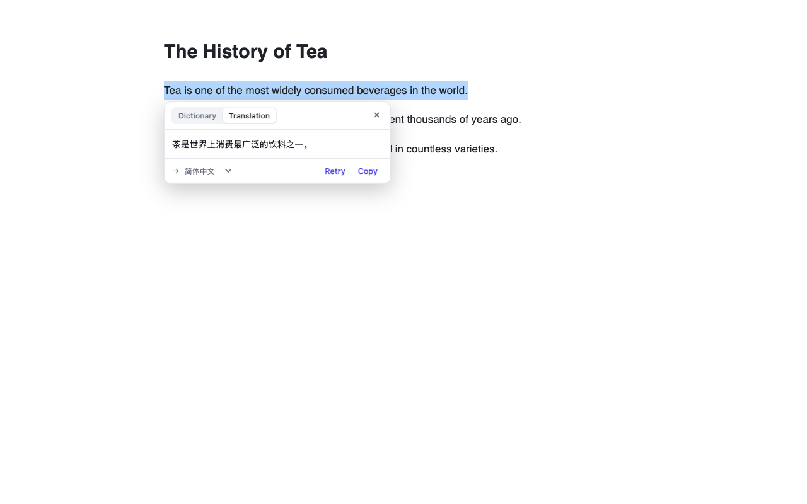
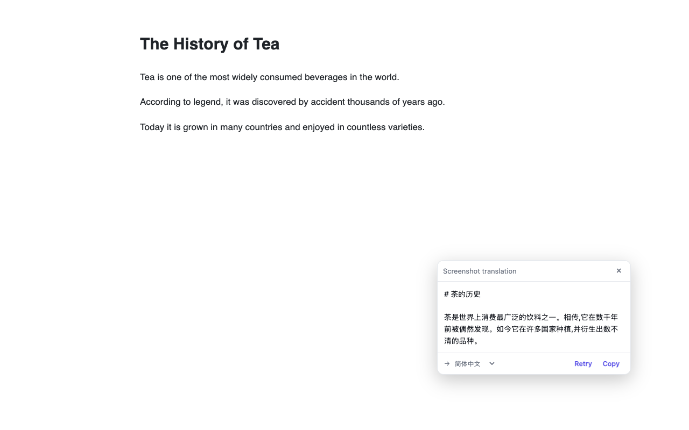

# Installing LLM Translate

**English** · [简体中文](./INSTALL.zh-CN.md)

This guide installs LLM Translate in **Chrome, Edge, or Firefox** without the store
listings, and sets it up for first use. It takes about two minutes.

> LLM Translate isn't on the Chrome Web Store or Firefox Add-ons (AMO) yet. None of
> the three browsers allow one-click installs of off-store extensions, so you install
> it by loading a prebuilt package — Chrome/Edge below, Firefox in its own section
> ([Install on Firefox](#install-on-firefox)).

## What you'll need

- **Google Chrome, Microsoft Edge, or Firefox** (any recent version; Firefox needs
  128 or later).
- **An API key** from an OpenAI-compatible or Anthropic-compatible provider — this
  is what actually does the translating (you bring your own key). Get one from,
  e.g., the OpenAI platform or the Anthropic console, or use any compatible
  gateway. Keep it handy for step 3.

## 1. Download the extension

1. Open the [Releases page](https://github.com/Junrin-Lee/llm-translate/releases).
2. Under the latest release, download the zip for your browser:
   - Chrome → `llm-translate-<version>-chrome.zip`
   - Edge → `llm-translate-<version>-edge.zip`
   - Firefox → loaded differently; see [Install on Firefox](#install-on-firefox) (nothing to download here)
3. **Unzip it to a folder you'll keep** — e.g. `Documents/llm-translate`. Don't
   delete or move this folder afterward: the browser loads the extension straight
   from that location.

> **No release available yet?** Either build it from source (see the end of this
> guide) or ask the maintainer to publish one.

## 2. Load it into your browser

The steps below are for **Chrome** and **Edge** (both Chromium-based, same method).
**Firefox is supported too, but loads differently — jump straight to
[Install on Firefox](#install-on-firefox) instead of following the steps below.**

### Chrome

1. Go to `chrome://extensions`.
2. Turn on **Developer mode** (toggle, top-right).
3. Click **Load unpacked**.
4. Select the **unzipped folder** from step 1 (the one containing `manifest.json`).

### Edge

1. Go to `edge://extensions`.
2. Turn on **Developer mode** (toggle, bottom-left).
3. Click **Load unpacked**.
4. Select the **unzipped folder** from step 1.

The LLM Translate icon now appears in the toolbar. Click the puzzle-piece icon and
pin it so it's always visible.

> Chrome may show a **"Disable developer mode extensions"** popup on startup. This
> is normal for any extension installed this way — dismiss it; the extension keeps
> working.

### Firefox

Firefox loads differently from Chromium (temporary load, or a signed `.xpi`). Head to
its dedicated section: [Install on Firefox](#install-on-firefox).

<a id="open-a-normal-page"></a>

## ⚠️ Read this before step 3: switch to a normal web page

> [!IMPORTANT]
> **The extension does not run on the browser's internal pages
> (`chrome://extensions`, `edge://extensions`).** If you stay on that page after
> installing, you'll see no translation features and no way into settings — this
> does **not** mean the install failed.

Open **any website in a new tab** (or refresh a page you already had open), then:

1. Click the **LLM Translate icon** in the toolbar (don't see it? click the
   **puzzle-piece icon** at the top-right and pin it).
2. Choose **Open settings** to reach the configuration in step 3 below.

> Tabs that were already open need a **refresh** first — the content script only
> injects into pages opened or refreshed after install.

## 3. Add your API key

1. Click the LLM Translate icon → **Open settings** (or right-click the icon →
   Options).
2. Go to **Providers** → **Add provider**.
3. Fill in:
   - **Protocol** — OpenAI-compatible or Anthropic-compatible.
   - **Base URL** — e.g. `https://api.openai.com/v1` or `https://api.anthropic.com`
     (or your own gateway).
   - **API key** — paste your key. It is stored only on this device and never
     synced or sent anywhere except the endpoint you set here.
   - **Model** — type it, or click **Fetch models** to pick from the list.
4. Click **Test connection** — you should see **Connected**.

## 4. Translate

- **Selection** — select text on any page, then click the icon that appears (or
  press `Ctrl/⌘ + Shift + S`).
- **Whole page** — click the toolbar icon → **Translate this page** (or press
  `Ctrl/⌘ + Shift + P`, or right-click → Translate this page).
- **Screenshot** — click the toolbar icon → **Screenshot Translation** (or
  right-click → Screenshot Translation), then drag-select a region to translate
  the text inside it. Needs a routed model that accepts image input.






For the full feature list (dictionary cards, bilingual / translation-only modes,
auto-translate sites, custom prompts, and more), see the [README](../README.md).

<a id="install-on-firefox"></a>

## Install on Firefox

Firefox isn't on the Chrome Web Store, so it gets its own listing and its own build
(still Manifest V3, same as Chrome/Edge — see
[ADR-0005](./adr/0005-firefox-mv3-with-permission-onboarding.md)). Pick one:

### Option A: Firefox Add-ons (AMO)

*(Link available after the first AMO review — not published yet.)* Once listed,
installing from AMO is a single click, like any other Firefox extension.

### Option B: Temporary install (for now, or for developers)

1. Build the zip: `pnpm install`, then `pnpm zip:firefox` → outputs
   `.output/llm-translate-<version>-firefox.zip`. (Needs Node.js 20 and pnpm 9 — see
   **Alternative: build from source** near the end of this guide.)
2. In Firefox, open `about:debugging#/runtime/this-firefox`.
3. Click **Load Temporary Add-on…** and select that `.zip` file directly — Firefox
   accepts the packed zip, no need to unzip it.

> **Temporary add-ons are removed when Firefox closes.** Until the AMO listing is
> live, you'll need to repeat steps 2–3 after every restart.

### Option C: Self-distribution — a signed `.xpi`, permanent and off-store

Option B disappears on restart, and release/beta Firefox refuse unsigned add-ons.
To install **permanently without listing on the store**, have Mozilla sign your
package through the **unlisted (self-distribution)** channel, then install the
returned `.xpi` yourself. It never shows up in AMO search — only whoever you hand
the file to can install it. Good for personal use or small internal sharing.

You'll need a free [Firefox account](https://accounts.firefox.com/) and AMO API
credentials (a **JWT issuer** and **secret**) from
[AMO → Manage API Keys](https://addons.mozilla.org/developers/addon/api/key/).

1. Create your `.env` from the tracked template, then fill in the two values
   (`.env` itself is git-ignored):
   ```sh
   cp .env.example .env
   ```
   Then edit `.env`:
   ```
   WEB_EXT_API_KEY=<your JWT issuer>
   WEB_EXT_API_SECRET=<your JWT secret>
   ```
2. Build and sign in one step (needs Node.js 20 + pnpm 9):
   ```sh
   pnpm sign:firefox
   ```
   This builds `.output/firefox-mv3/`, loads the credentials from `.env`, and runs
   the **pinned `web-ext@7.11.0`** (newer web-ext rejects our minified production
   bundle and forces manual review). Mozilla auto-reviews unlisted submissions
   (usually a minute or two); the signed package lands at
   `web-ext-artifacts/<id>-<version>.xpi`.
3. Install it: `about:addons` → gear icon ⚙️ → **Install Add-on From File…** → pick
   the `.xpi` (or drag the file into a Firefox window) → **Add**. This install
   **survives restarts.**

> **Bump the version for every update.** AMO accepts each `(extension id, version)`
> pair only once. To ship a code change, bump `version` in `wxt.config.ts` /
> `package.json`, re-run `pnpm sign:firefox`, then reinstall the new `.xpi`.

> **Source code may be requested.** Because the bundle is minified, AMO occasionally
> asks for readable sources — pass `--upload-source-code=<sources.zip>` to the sign
> command if it does.

### Grant site access

Unlike Chrome/Edge, Firefox treats the "read and change data on all websites"
permission as **optional and revocable**, not automatic:

- **At install / temporary-load time** — Firefox may show a permission prompt or an
  "Allow this extension to run on all sites" toggle. Keep it **on**; both Selection
  Translation and Page Translation need it to work on any page.
- **If you declined it (or this is the first launch)** — the extension opens an
  onboarding tab automatically, with a single **Grant site access** button.
- **If you revoke it later** (`about:addons` → LLM Translate → **Permissions** →
  turn off "Access your data for all websites") — the toolbar icon shows a red
  **"!"** badge, and both the popup and the settings page show a warning banner
  with a **Grant access** button. Click either one to restore access — no
  reinstall needed.

Once site access is granted, continue with **step 3, Add your API key** above.

## Updating

Unpacked extensions **don't auto-update**. To update:

1. Download the new zip from the Releases page.
2. Unzip it, replacing your existing folder (keep the same location).
3. Open `chrome://extensions` (or `edge://extensions`) and click the **reload** (↻)
   button on the LLM Translate card.

## Troubleshooting

- **A "developer mode" warning appears on every launch** — normal for
  load-unpacked extensions; safe to dismiss.
- **The extension suddenly stopped working** — you likely moved or deleted the
  unzipped folder. Put it back, or load it again (step 2).
- **No icon appears when I select text** — refresh the page (the content script
  only runs on pages opened after install), confirm the site isn't in your disable
  list, and make sure a provider is configured.
- **"No provider configured" or the connection fails** — re-check the Base URL and
  API key in settings, then click Test connection.
- **Remove it** — `chrome://extensions` → **Remove** on the card.

## Alternative: build from source (for developers)

Requires **Node.js 20** and **pnpm 9**.

```sh
git clone https://github.com/Junrin-Lee/llm-translate
cd llm-translate
corepack prepare pnpm@9.15.9 --activate   # if pnpm is missing
pnpm install
pnpm build            # -> .output/chrome-mv3/   (Edge: pnpm build:edge -> .output/edge-mv3/)
```

Then load `.output/chrome-mv3/` via **Load unpacked** (step 2). See the
[README](../README.md) for the full development workflow.
